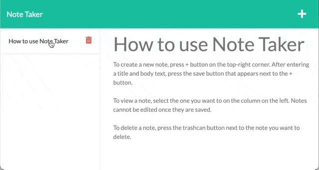

# glowing-notetaker

> Write and save your notes wherever you go

## Description

Check it out here at [https://sleepy-fjord-89041.herokuapp.com/](https://sleepy-fjord-89041.herokuapp.com/). You can write notes on the go and save them whenever you need them. No longer need a note, feel free to trash it. Here are some key features:

- Ability to create notes
- Ability to view your notes
- Ability to delete a note as needed

## Using the App



To create a new note, press `+` button on the top-right corner. After entering a title and body text, press the save button that appears next to the `+` button.

To view a note, select the one you want to on the column on the left. Notes cannot be edited once they are saved.

To delete a note, press the trashcan button next to the note you want to delete.

## Project Setup

Install dependencies

```shell
npm install
```

Run the server

```shell
npm start
```

The server should output which port it is on. The port may be assigned by your environment variable or default to `3001`.

## API

No authentication is required to access this API, and all resources are open and available. However, the frequency and availability of requests may be limited.

### `POST` A New Note and the `notes` Objects

Route: `https://sleepy-fjord-89041.herokuapp.com/api/notes`

Each `note` should have the following for `POST` requests:

- `title` - A heading of the note. This may be blank.
- `text` - The body of the note. This may be blank.

> Sample `POST` format for `note`
>
> ```json
> {
>  "title": "Favorite Sandwich",
>  "text": "Italian and Grilled Cheese Ruben sandwiches are the best!"
> }
> ```

After creation, a unique id is assigned

### `GET` All Notes

Route: `https://sleepy-fjord-89041.herokuapp.com/api/notes`

Responds with array of notes objects.

> Sample response
>
> ```json
> [
>   {
>    "title": "Favorite Sandwich",
>    "text": "Italian and Grilled Cheese Ruben sandwiches are the best!",
>    "id": "5a1d6asPXCLo29qW"
>   },
>   {
>    "title": "?? operator",
>    "text": "The nullish coalescing operator is expressed with `??`",
>    "id": "5a1d6asPXCLo29qW"
>   },
>   ... // more notes objects
> ]
> ```

### `DELETE` A Note

Route: `https://sleepy-fjord-89041.herokuapp.com/api/notes/{:id}`

Replace `{:id}` with id to delete.

> Sample `DELETE` format for `note` with id `5a1d6asPXCLo29qW` found
>
> Route with id: `https://sleepy-fjord-89041.herokuapp.com/api/notes/5a1d6asPXCLo29qW`
>
> Response: _(All remaining notes)_
>
> ```json
> // 200 OK
> [
>   {
>    "title": "?? operator",
>    "text": "The nullish coalescing operator is expressed with `??`",
>    "id": "5a1d6asPXCLo29qW"
>   },
>   ... // more notes objects
> ]
> ```

If an id is not found in the dataset, api will respond with 400.

> Sample `DELETE` format for `note` with id not found
>
> Route with id: `https://sleepy-fjord-89041.herokuapp.com/api/notes/94dFx32mKLqH199`
>
> Response:
>
> ```json
> // 400 Bad Request
> Note with ID 94dFx32mKLqH199 not found. Check id of target.
> ```

## Built With

- [Express](http://expressjs.com/)

- [Uniqid](https://github.com/adamhalasz/uniqid)

A unique hexatridecimal ID generator.

## License

This application is licensed via [Unlicense](https://unlicense.org).
